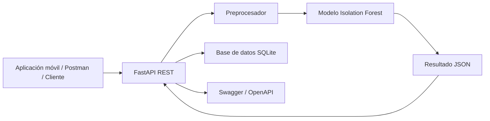

# Diagrama de arquitectura del microservicio

```mermaid
flowchart LR
    A[Aplicación móvil / Postman / Cliente] --> B[FastAPI REST]
    B --> C[Preprocesador]
    C --> D[Modelo Isolation Forest]
    B --> E[Base de datos SQLite]
    B --> F[Swagger / OpenAPI]
    D --> G[Resultado JSON]
    G --> B
```
